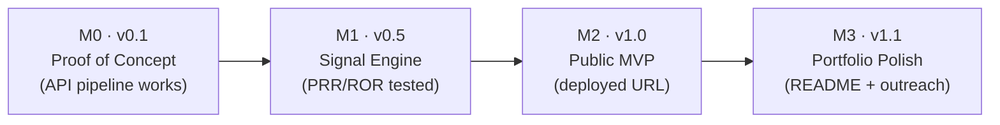

# PharmSignal — Master Roadmap & Linear Project Plan

> **Product one-liner:** A web app where you type a drug name and see which adverse events are disproportionately reported in the FDA's public FAERS database, computed with the industry-standard disproportionality metrics (PRR and ROR with 95% CI).

**Document purpose.** This is the single source of truth for project management. It is structured to be imported into **Linear** (our PM tool, operated via MCP) as: one Project → four Milestones → issues with priority, estimate, labels, and acceptance criteria. Every issue below explains *why* it exists, not just *what* to do — this project is a portfolio piece for a Drug Safety Physician / Pharmacovigilance role, and the process itself (scoped milestones, versioned releases, honest risk log) is part of what it demonstrates.

**Why this project matters.** Disproportionality analysis is the core quantitative method of signal detection in pharmacovigilance. Building it end-to-end — data source, statistics, UI, regulatory disclaimer — shows a hiring manager that the candidate already speaks the language of PV signal management, not just clinical medicine.

---

## Scope review sign-off (Safety Director)

Reviewed against industry practice before planning. **Verdict: scope approved.**

| Check | Assessment |
|---|---|
| Methodology | ✅ PRR and ROR from a 2×2 contingency table is the standard screening approach (Evans et al., 2001; EMA GVP Module IX context). |
| Signal criteria | ✅ PRR ≥ 2, chi² ≥ 4, case count a ≥ 3 — the classic Evans criteria. ⚠️ chi² was missing from the original Phase 1 task list; added in PS-9. |
| Data source | ✅ openFDA API over raw FAERS quarterly files is the right completeness-for-simplicity trade-off for an MVP, and stating that trade-off is itself an interview talking point. |
| Scope cuts | ✅ No database, no auth, no Docker — correct for a portfolio MVP. |
| Regulatory tone | ✅ Statistical-not-causal disclaimer is mandatory and non-negotiable. |
| Addition | ➕ PS-14: label reactions as MedDRA Preferred Terms in the UI — small task, high credibility with PV reviewers. |

---

## Linear setup conventions

**Project:** `PharmSignal — FAERS Signal Detector`
**Milestones:** map 1:1 to the phases below, each tied to a release version.
**Issue ID convention:** `PS-#` (assigned by Linear; the numbers below are for cross-reference in this doc).

**Priorities** (Linear native):
- **Urgent/P0** — MVP-blocking; the release does not ship without it.
- **High/P1** — ships in the milestone if time allows; first cut candidates.
- **Medium/P2** — polish; never blocks a release.

**Labels:** `data-api` · `statistics` · `frontend` · `testing` · `deploy` · `docs` · `pv-domain`

**Estimates:** Linear points, 1 pt ≈ 30–45 min of focused work.

**Workflow states:** Backlog → Todo → In Progress → In Review (self-review against acceptance criteria) → Done. An issue is only Done when its acceptance check passes.

**Definition of "% complete" per milestone:** (Done P0 issues ÷ total P0 issues) — P1/P2 do not count toward release readiness, by design.

---

## Release plan

| Version | Milestone | Deliverable | Deploy target |
|---|---|---|---|
| `v0.1` | M0 — Proof of Concept | CLI script hitting the live openFDA API | Local only |
| `v0.5` | M1 — Signal Engine | Tested PRR/ROR engine, importable module | Local only |
| `v1.0` | M2 — Public MVP | Streamlit app, publicly deployed | Streamlit Community Cloud |
| `v1.1` | M3 — Portfolio Polish | English README, comparisons, CSV export, LinkedIn post | Same URL, redeploy |

Versioning is semantic-ish on purpose: `v1.0` is the first public, recruiter-shareable artifact. Each version is a git tag; each deploy is a Linear issue with a checklist, so the deployment history is auditable.

---

## Milestone 0 — Setup & Proof of Concept (`v0.1`)

**Goal:** prove the data pipeline works before writing any product code. Est. one ~3h session.
**Exit criterion:** `python poc.py` prints a real drug→adverse-event count table from the live API.

| ID | Priority | Est | Labels | Issue |
|---|---|---|---|---|
| PS-1 | P0 | 1 | `deploy` | **Create GitHub repo `pharmsignal`** with Python `.gitignore` and MIT license. *Why: public repo from day one — the commit history is part of the portfolio.* |
| PS-2 | P0 | 1 | `data-api` | **Obtain free openFDA API key**, store in `.env`, never commit. Add `.env.example`. *Why: raises rate limit to 120k req/day; secrets hygiene is a reviewable skill.* |
| PS-3 | P0 | 2 | `data-api` | **Write `poc.py`:** for a fixed drug (e.g. `"metformin"`), fetch the top 20 reported adverse events via `count=patient.reaction.reactionmeddrapt.exact`. |
| PS-4 | P0 | 1 | `testing`, `pv-domain` | **Validate counts manually** against the openFDA web interface. *Why: data validation before analysis is basic PV discipline — never trust a pipeline you haven't spot-checked.* |

**Acceptance criteria (M0):** script runs end-to-end; console table matches manual spot-check; repo public with license.

---

## Milestone 1 — Signal Engine (`v0.5`)

**Goal:** the statistical core, correct and tested. This is the milestone a PV-literate reviewer will actually read. Est. 1–2 sessions.
**Exit criterion:** `detect_signals("amiodarone")` returns a DataFrame with `event, a, PRR, PRR_CI, ROR, ROR_CI, chi2, signal` and clinically plausible results (thyroid disorders must appear — a built-in positive control).

| ID | Priority | Est | Labels | Issue |
|---|---|---|---|---|
| PS-5 | P0 | 2 | `data-api` | **`contingency(drug, event)`** → returns a, b, c, d from 4 count queries (drug∧event, drug total, event total, database total). |
| PS-6 | P0 | 2 | `statistics` | **`prr(a,b,c,d)` and `ror(a,b,c,d)`** with 95% CI (standard log-normal formula). |
| PS-7 | P0 | 2 | `statistics`, `pv-domain` | **`detect_signals(drug, top_n=20)`**: compute PRR/ROR for each top-N event, flag `signal=True` per the full Evans criteria. |
| PS-8 | P1 | 2 | `testing` | **Unit tests** for the formulas against a hand-calculated case; commit the verification spreadsheet. *Why: shows the numbers were checked by a human, not assumed — exactly what a safety physician is paid to do.* |
| PS-9 | P0 | 1 | `statistics`, `pv-domain` | **Add chi² (Yates-corrected) to the signal rule** so the flag is PRR ≥ 2 AND chi² ≥ 4 AND a ≥ 3. *Why: closes the gap between the scope's stated criteria and the implementation.* |
| PS-10 | P1 | 2 | `data-api` | **Error handling:** drug not found, API down, zero cells (Haldane–Anscombe +0.5 correction to avoid division by zero). |

**Acceptance criteria (M1):** amiodarone positive control passes; unit tests green; zero-count query does not crash.

---

## Milestone 2 — Public MVP (`v1.0`)

**Goal:** a public URL a recruiter can open on their phone. Est. 1–2 sessions.
**Exit criterion:** public link works on mobile; 3 different drug searches each respond in < 15 s.

| ID | Priority | Est | Labels | Issue |
|---|---|---|---|---|
| PS-11 | P0 | 3 | `frontend` | **`app.py` in Streamlit:** drug search box, results table sorted by PRR descending, red badge on flagged signals. |
| PS-12 | P0 | 1 | `frontend` | **Horizontal bar chart** of the top 10 PRRs (Streamlit native or matplotlib). |
| PS-13 | P0 | 1 | `frontend`, `pv-domain` | **Visible disclaimer:** *"Signals are statistical, not causal. Educational tool using public FDA data."* *Why: regulatory maturity — the single cheapest way to look professional to a PV reviewer.* |
| PS-14 | P2 | 1 | `frontend`, `pv-domain` | **Label reactions as MedDRA Preferred Terms** in the table header/tooltip. *Why: signals familiarity with PV terminology standards.* |
| PS-15 | P0 | 2 | `deploy` | **Deploy to Streamlit Community Cloud** with secrets configured; tag `v1.0`. Deploy checklist: secrets set → app boots → 3 test drugs verified → mobile check. |
| PS-16 | P1 | 1 | `frontend` | **Loading spinner + `st.cache_data` (24 h TTL)** per drug. *Why: rate-limit protection and snappy live demos.* |

**Acceptance criteria (M2):** all P0 done; public URL live; disclaimer visible without scrolling.

---

## Milestone 3 — Portfolio Polish (`v1.1`)

**Goal:** make the project legible to a non-technical recruiter in 30 seconds. Est. 1 session.
**Exit criterion:** a layperson understands what the app does from the README alone.

| ID | Priority | Est | Labels | Issue |
|---|---|---|---|---|
| PS-17 | P0 | 2 | `docs` | **English README:** problem in 3 sentences → screenshot → live link → methodology (PRR/ROR formulas) → honest limitations (FAERS reporting bias, no exposure denominator, duplicate reports). |
| PS-18 | P1 | 2 | `frontend` | **Side-by-side comparison of 2 drugs** (Streamlit tabs). |
| PS-19 | P1 | 1 | `frontend` | **"Download CSV"** button for results. |
| PS-20 | P2 | 1 | `docs` | **LinkedIn post (English)** presenting the project — first public artifact in the clinical AI/PV space. |
| PS-21 | P1 | 1 | `docs`, `pv-domain` | **Interview prep issue ("Prep"):** written 60-second PRR-vs-ROR explanation in the README + the two scope talking points (API trade-off; screening ≠ causality, next step is case-level medical assessment). |

**Acceptance criteria (M3):** README passes the 30-second layperson test; `v1.1` tagged and redeployed.

---

## Definition of Done (whole project)

1. Public URL live + English README with screenshot.
2. Formulas covered by unit tests + committed verification spreadsheet.
3. Regulatory disclaimer visible in the app.
4. PRR vs ROR explainable in 60 seconds, written down in the README.

## Risk register

| Risk | Likelihood | Impact | Mitigation |
|---|---|---|---|
| openFDA rate limit hit during a live demo | Medium | High | 24 h cache + 3 pre-cached example drugs as clickable chips (PS-16) |
| openFDA API downtime | Low | Medium | Graceful error message (PS-10); demo GIF in README as fallback |
| Implausible results undermine credibility | Low | High | Amiodarone→thyroid positive control baked into M1 acceptance |
| Scope creep delays the public URL | Medium | High | Cut order below; P0-only definition of release readiness |

**Cut order if time runs short:** drug comparison (PS-18) → CSV download (PS-19) → bar chart (PS-12). **Never cut:** correct formulas and the disclaimer.

## Flow overview

